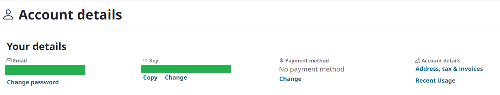
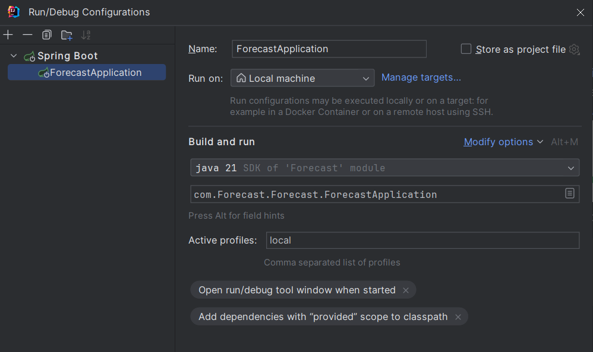

# Forecast App

## Table of Contents

- [General info](#Generalinfo)
- [Requirements](#Requirements)
- [Technologies](#Technologies)

## General info <a name = "Generalinfo"></a>

<a href="https://spring.io/projects/spring-boot" target="blank"> Spring Boot</a> application about forecast. The application provide user to get weather data. The application is connected to <a href="https://spring.io/projects/spring-boot" target="blank"> Weather API</a> to fetch weather data.

| Method |       URL        |             Description           |
| ------ | ---------------- | --------------------------------- |
| `Get`  | `/forecast/city` | Receives weather data for 15 days |

## Requirements <a name = "Requirements"></a>

- <a href="https://spring.io/projects/spring-boot" target="blank"> JDK 21 </a>
- <a href="https://spring.io/projects/spring-boot" target="blank"> Maven 3.x </a>

## How to run locally <a name = "How to run locally"></a>

1. Register account on https://weather.visualcrossing.com
2. Login to your account and copy api-key from: https://www.visualcrossing.com/account

3. Create application-local.yml with structure like:
   ``` yaml 
   weather:
      client:
        api-key: changeMe
   ```
4. Replace changeMe with api-key from 
5. Set profile to local in configuration


## Technologies <a name = "Technologies"></a>

### Project Created with:

- **Java 21** - The core programming language for building the project.
- **Spring boot** - Facilitates the development of robust and scalable applications, providing a comprehensive framework for Java development.

### Integration:

- **feign** - A declarative web service client used for simplifying API integration.

### Documentation:
- **swagger** - A tool for designing, building, documenting, and consuming RESTful web services.

### Tests:
- **JUnit** - A widely used testing framework for Java applications.
- **Mockito** - A mocking framework for creating and configuring mock objects.
- **wiremock** - Library for simulating HTTP-based services during testing.

### Build tools:
- **Maven** - A build automation tool for managing dependencies and building Java projects.